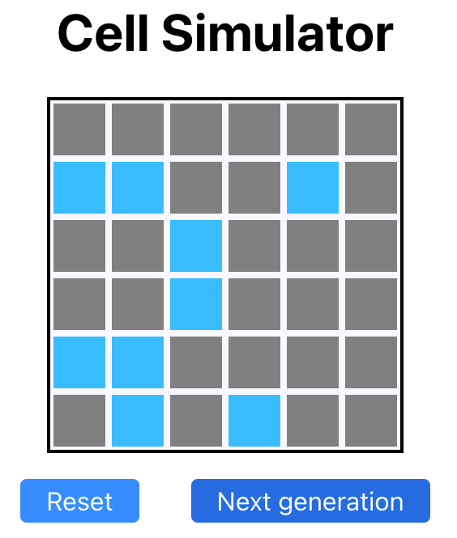

# Cell Simulator
## Cell simulator
[Live Demo](https://heyedd.com/cell_simulator)




## Installation
```
<git clone the repo>
<cd into the folder>
npm i
npm start
```

## Usage - How to play
1. Configure the board size
  - The board size can be adjusted in `constants.js`. Minimum side size should be 5, default is 6x6.
2. Perform initial state setup
  - Click on the cells to setup the cells as DEAD or LIVE before you start the simulation.
3. Then play!
  - You can play by clicking the 'next generation' button (multiple times) to see what happens!

## Game rules
Cell next generation rules:
1. A Cell with fewer than two live neighbours dies of under-population.
2. A Cell with 2 or 3 live neighbours lives on to the next generation.
3. A Cell with more than 3 live neighbours dies of overcrowding.
4. An empty Cell with exactly 3 live neighbours "comes to life".
5. A Cell who "comes to life" outside the board should wrap at the other side of the
board.

**Please note! Implementation Notes:**
- The above rules are applied from bottom to top. 
- Hence, the bottom rule's output will take precidence and the top the least precedence.
## Unit testing
```
npm test
```
